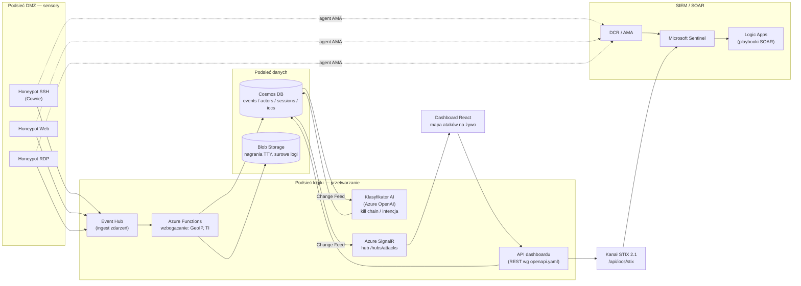

# HoneyGrid — rozproszona platforma threat intelligence


HoneyGrid to rozproszona platforma wywiadu o zagrożeniach zbudowana w chmurze Azure.
Sieć sensorów honeypot (SSH / web / RDP) przyciąga rzeczywiste ataki z internetu,
a potok zdarzeń w czasie rzeczywistym wzbogaca każdą próbę ataku o geolokalizację
i zewnętrzne źródła threat intelligence, klasyfikuje ją przy pomocy AI
(faza kill chain, zaawansowanie, intencja), publikuje wskaźniki kompromitacji
w formacie **STIX 2.1**, integruje się z **Microsoft Sentinel / SOAR**
i prezentuje wszystko na dashboardzie React aktualizowanym na żywo przez SignalR.

## Architektura



Dwie równoległe ścieżki telemetrii:

1. **SIEM** — sensory → DCR/AMA → Log Analytics → Sentinel (reguły analityczne, playbooki SOAR),
2. **Realtime** — sensory → Event Hub → Functions (wzbogacanie) → Cosmos DB → Change Feed → SignalR → dashboard.

Szczegóły: [docs/architektura.md](docs/architektura.md). Kontrakt API: [docs/openapi.yaml](docs/openapi.yaml).

## Struktura monorepo

```
HoneyGrid-Threat-Intelligence/
├── src/
│   ├── HoneyGrid.Contracts/      # Wspólny schemat zdarzeń (NuGet wewnętrzny)
│   ├── HoneyGrid.Sensors/        # Sensory honeypot i shippery logów
│   ├── HoneyGrid.Ingestion/      # Ingest z Event Huba
│   ├── HoneyGrid.Functions/      # Functions: wzbogacanie, klasyfikacja, agregacje
│   ├── HoneyGrid.Stix/           # Generator paczek STIX 2.1
│   ├── HoneyGrid.Api/            # API dashboardu (kontrakt: docs/openapi.yaml)
│   └── HoneyGrid.Web/            # Frontend React (Vite + TS + Tailwind v4)
├── infra/
│   └── bicep/                    # main.bicep + moduły, parametry dev/prod
├── docs/                         # openapi.yaml, architektura.md
├── fixtures/                     # Stałe punkty styku do pracy równoległej
├── tests/                        # Testy .NET
└── .github/workflows/            # CI/CD (GitHub Actions)
```

## Stack technologiczny

| Warstwa | Technologia |
|---|---|
| Backend | .NET 10 (C#), Azure Functions (isolated worker) |
| Frontend | React 18.2, Vite, TypeScript, Tailwind CSS v4, MSW (mocki) |
| Infrastruktura jako kod | Bicep (moduły + parametry dev/prod) |
| Usługi Azure | Event Hubs, Cosmos DB, Azure SignalR Service, Blob Storage, Azure OpenAI, Microsoft Sentinel, Log Analytics, Logic Apps, Container Registry, Static Web Apps, Key Vault |
| Honeypoty | Cowrie (SSH), własne sensory web/RDP |
| Standardy | OpenAPI 3.1, STIX 2.1, MITRE ATT&CK, Cyber Kill Chain |

## 5 killer-funkcji

1. **Odtwarzanie sesji** — nagrania TTY sesji atakujących odtwarzane w przeglądarce klatka po klatce (format asciicast).
2. **Mapa ataków na żywo** — zdarzenia z całego świata na mapie w czasie rzeczywistym (SignalR, bez odświeżania).
3. **Profilowanie aktorów AI** — korelacja aktywności w klastry aktorów + dossier generowane przez LLM (archetyp, cele, poziom zagrożenia).
4. **Kanał STIX 2.1 / IoC** — wskaźniki kompromitacji publikowane w standardzie przemysłowym, gotowe do konsumpcji przez Sentinel/TAXII.
5. **Analiza poświadczeń** — ranking najczęściej atakowanych loginów, haseł i par login/hasło.

## Podział pracy

| | **Track A — Detekcja i Reagowanie** | **Track B — Wywiad i Doświadczenie** |
|---|---|---|
| Sensory | Honeypoty (Cowrie, web, rdp), shipping logów | — |
| Potok | Event Hub, ingest, wzbogacanie (GeoIP, TI) | Klasyfikator AI, profilowanie aktorów |
| SIEM | DCR → Sentinel, reguły, playbooki SOAR | — |
| Dane | Cosmos DB (events, sessions), Blob (TTY) | Cosmos DB (actors, iocs, aggregates) |
| API | Implementacja endpointów wg `docs/openapi.yaml` | Generator STIX 2.1 |
| Frontend | — | Dashboard React, mapa, odtwarzacz sesji |
| Infra | Bicep: sieć, sensory, Event Hub, Sentinel | Bicep: Cosmos, SignalR, SWA, OpenAI |

**Kontrakty pracy równoległej** (nikt na nikogo nie czeka):
schemat zdarzeń w `HoneyGrid.Contracts`, kontrakt REST w `docs/openapi.yaml`
(frontend mockuje przez MSW), fixtures w [`fixtures/`](fixtures/README.md).

## Uruchomienie lokalne

Wymagania: .NET SDK 10, Node.js 24, Azure Functions Core Tools, (opcjonalnie) Azurite.

```bash
# Backend — budowa i testy
dotnet build HoneyGrid.sln
dotnet test HoneyGrid.sln

# API lokalnie (Azure Functions)
cd src/HoneyGrid.Functions
func start

# Frontend — dev server z mockami MSW (nie wymaga backendu)
cd src/HoneyGrid.Web
npm ci
npm run dev
```

Frontend domyślnie korzysta z mocków MSW wygenerowanych z `docs/openapi.yaml`,
więc oba tracki mogą pracować w pełni równolegle.

## Harmonogram (8 tygodni)

| Tydzień | Track A | Track B |
|---|---|---|
| 1 | Sieć + Bicep (3 podsieci), pierwszy honeypot Cowrie | Szkielet dashboardu, mocki MSW z OpenAPI |
| 2 | Event Hub + ingest zdarzeń | Mapa ataków (dane z mocków) |
| 3 | Wzbogacanie GeoIP + threat intel | Kanał zdarzeń na żywo + statystyki |
| 4 | DCR → Sentinel, pierwsze reguły | Stub-klasyfikator → analiza poświadczeń |
| 5 | Cosmos Change Feed → SignalR (realtime E2E) | Klasyfikator AI (Azure OpenAI) |
| 6 | Playbooki SOAR (Logic Apps) | Profilowanie aktorów + dossier AI |
| 7 | Nagrania TTY → Blob, API replay | Odtwarzacz sesji, kanał STIX 2.1 |
| 8 | Hardening, testy E2E, deploy prod | Szlif UX, dokumentacja, demo |

## Etyka i bezpieczeństwo

- Honeypoty są **pasywne** — wyłącznie rejestrują ataki przychodzące; platforma nie wykonuje żadnych działań ofensywnych.
- Sensory działają w izolowanej podsieci DMZ z restrykcyjnymi NSG; nie mają dostępu do danych ani sieci wewnętrznej.
- Pobierane przez atakujących artefakty są przechowywane wyłącznie jako skróty SHA-256 i nigdy nie są uruchamiane.
- Adresy IP atakujących to dane telemetryczne o charakterze bezpieczeństwa; retencja danych jest ograniczona (TTL 180 dni) zgodnie z zasadą minimalizacji.
- Sekrety wyłącznie w Key Vault / GitHub Secrets — nigdy w repozytorium.
- Projekt ma charakter edukacyjny (kurs Azure) i służy badaniu technik atakujących w kontrolowanym środowisku.

## Licencja

MIT — zobacz [LICENSE](LICENSE).
