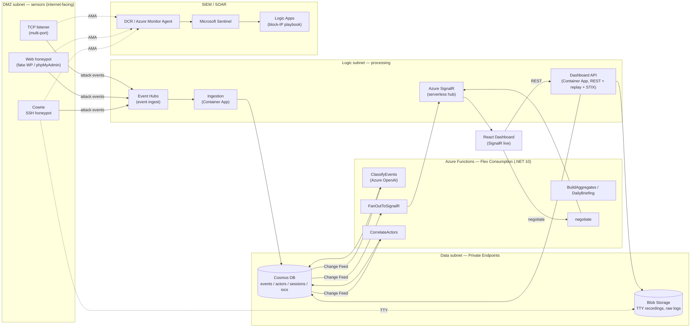

<div align="center">

# 🛡️ HoneyGrid — Distributed Threat Intelligence Platform

**A cloud-native honeypot grid that lures real internet attacks, enriches them with AI, and visualises the threat landscape in real time.**


</div>

<!-- ───────────────────────────────────────────────────────────────────────── -->
<!-- 📸 SCREENSHOTS: drop PNGs into docs/screenshots/ with the names referenced -->
<!--    below. Each placeholder renders once the file exists.                   -->
<!-- ───────────────────────────────────────────────────────────────────────── -->

<div align="center">


<sub>_Main dashboard — live KPIs, attack stream and 3D globe._</sub>

</div>

---

## 📋 Table of Contents

- [What is HoneyGrid?](#-what-is-honeygrid)
- [Key Features](#-key-features)
- [Screenshots](#-screenshots)
- [Architecture](#-architecture)
- [Tech Stack](#-tech-stack)
- [Repository Layout](#-repository-layout)
- [Getting Started](#-getting-started)
- [Deploying to Azure](#-deploying-to-azure)
- [External Sensors (VPS)](#-external-sensors-vps)
- [Security & Ethics](#-security--ethics)
- [License](#-license)

---

## 🍯 What is HoneyGrid?

HoneyGrid is a distributed **threat-intelligence platform** built entirely on Microsoft Azure. A grid of **honeypot sensors** (SSH, Web, and raw TCP) is exposed to the public internet and deliberately *invites* attacks. Every probe, brute-force attempt, captured credential and shell command is streamed through a real-time pipeline that:

- **enriches** each event with geolocation, ASN and threat-intel reputation;
- **classifies** it with **Azure OpenAI** (Cyber Kill Chain phase, category, sophistication, intent);
- **correlates** attacker activity into **threat-actor profiles** with LLM-generated dossiers;
- **publishes** indicators of compromise as an industry-standard **STIX 2.1** feed;
- **integrates** with **Microsoft Sentinel** and a **SOAR** auto-block playbook;
- **streams** everything to a live React dashboard over **SignalR** — no page refresh.

Two parallel telemetry paths run side by side:

1. **Real-time** — sensors → Event Hubs → ingestion → Cosmos DB → Change Feed → Functions (AI + fan-out) → SignalR → dashboard.
2. **SIEM** — sensors → Data Collection Rule / Azure Monitor Agent → Log Analytics → Microsoft Sentinel → Logic Apps (SOAR).

---

## ✨ Key Features

| | Feature | Description |
|---|---|---|
| 🎬 | **Session Replay** | Interactive SSH sessions captured by Cowrie are stored as binary TTY recordings and replayed in the browser, keystroke-by-keystroke. |
| 🌍 | **Live Attack Map** | A 3D globe plots attacks worldwide the instant they happen, pushed over SignalR. |
| 🧠 | **AI Actor Profiling** | Attacker activity is clustered into actors; an LLM writes a dossier (archetype, goals, threat level). |
| 📡 | **STIX 2.1 / IoC Feed** | Indicators of compromise exported in a standard format, ready for Sentinel / TAXII consumption. |
| 🔑 | **Credential Analytics** | Ranking of the most-attacked usernames, passwords and login/password pairs. |
| 🤖 | **AI Classification** | Every event scored for kill-chain phase, category, sophistication and intent by Azure OpenAI. |
| 🛰️ | **Real-time everything** | Cosmos Change Feed → SignalR keeps the feed, map, KPIs and toasts live without polling. |

---

## 📸 Screenshots

> Place the images in `docs/screenshots/`. Suggested captures below.

| | |
|:---:|:---:|
| <br/><sub>**Live Attack Map** — real-time global attack arcs</sub> | <br/><sub>**Live Feed** — event stream + session dump + threat intel</sub> |
| <br/><sub>**Threat Actors** — AI-clustered actor dossiers</sub> | <br/><sub>**Session Replay** — TTY playback of attacker shells</sub> |
| <br/><sub>**Credentials** — most-attacked logins & passwords</sub> | <br/><sub>**IoC / STIX** — exportable indicator feed</sub> |
| <br/><sub>**AI Integrations** — model & MCP audit view</sub> | <br/><sub>**SDN Monitoring** — node health & traffic</sub> |

---

## 🏗️ Architecture



The entire network is **private by default**: Cosmos, Storage and Key Vault sit behind **Private Endpoints**, traffic is segmented into **DMZ / Logic / Data** subnets with **anti-pivot NSGs** (a compromised sensor cannot reach the analytics tier), and every service authenticates with **Managed Identity** — no connection strings in app settings.

📐 Deep dive: [`docs/architektura.md`](docs/architektura.md) · API contract: [`docs/openapi.yaml`](docs/openapi.yaml)

---

## 🧰 Tech Stack

| Layer | Technology |
|---|---|
| **Backend** | .NET 10 (C#), Azure Functions isolated worker on **Flex Consumption** |
| **Frontend** | React + Vite + TypeScript, Tailwind CSS v4, Zustand, TanStack Query, react-globe.gl (Three.js), Recharts, i18n (EN/PL/RU) |
| **Realtime** | Azure SignalR Service (serverless mode) |
| **Infrastructure as Code** | Bicep (modular, dev/prod parameter sets) |
| **Azure services** | Container Apps, Azure Functions (Flex), Cosmos DB, Event Hubs, Service Bus, Blob Storage, Azure OpenAI, SignalR, Key Vault, Container Registry (ACR), Microsoft Sentinel, Log Analytics, Logic Apps, Application Insights |
| **Honeypots** | Cowrie (SSH), custom Web & TCP sensors (.NET) |
| **Standards** | OpenAPI 3.1, STIX 2.1, MITRE ATT&CK, Cyber Kill Chain |

---

## 📂 Repository Layout

```
HoneyGrid-Threat-Intelligence/
├── src/
│   ├── HoneyGrid.Contracts/      # Shared event schema (internal package)
│   ├── HoneyGrid.Sensors/        # Web & TCP honeypot sensors + Cowrie log shipper
│   ├── HoneyGrid.Ingestion/      # Event Hubs → Cosmos ingest worker (Container App)
│   ├── HoneyGrid.Functions/      # Change-feed pipeline: classify, fan-out, actors, aggregates
│   ├── HoneyGrid.Stix/           # STIX 2.1 bundle generator
│   ├── HoneyGrid.Replay/         # TTY recording parser (Session Replay)
│   ├── HoneyGrid.Api/            # Dashboard REST API (Container App)
│   └── HoneyGrid.Web/            # React dashboard (Vite + TS + Tailwind v4)
├── sensors/
│   ├── cowrie/                   # Cowrie config + Dockerfile
│   └── docker-compose.vps.yml    # External-sensor deployment on a VPS
├── infra/
│   └── bicep/                    # main.bicep + modules + dev/prod params
│       └── modules/              # network, data, app, functions, ai, security, sentinel, soar…
├── docs/                         # architecture, OpenAPI, deployment guides, screenshots
├── fixtures/                     # Stable contract fixtures for parallel work
└── tests/                        # .NET tests
```

---

## 🚀 Getting Started

### Prerequisites

- **.NET SDK 10**
- **Node.js 20+** (Vite, npm)
- **Azure CLI** (`az`) + **Docker** (for image builds)
- *(optional)* Azure Functions Core Tools, Azurite

### Run the frontend locally

The dashboard has two modes, controlled by the build:

**A) Mock mode (no backend needed)** — uses MSW mocks generated from the OpenAPI contract and a built-in attack simulator. Best for UI work:

```bash
cd src/HoneyGrid.Web
npm ci
npm run dev          # http://localhost:5173 — MSW mocks + simulated live feed
```

**B) Live mode (against real Azure backends)** — MSW is disabled in production builds, so the app talks to the deployed API and SignalR hub from `.env.production`:

```bash
cd src/HoneyGrid.Web
npm run build        # bakes VITE_API_BASE + VITE_SIGNALR_URL into the bundle
npm run preview      # serves the production build; open the printed URL
```

> `.env.production` holds `VITE_API_BASE` (Container App API FQDN) and `VITE_SIGNALR_URL`
> (Functions SignalR base, ending in `/api/hubs/attacks`).

### Build the backend

```bash
dotnet build HoneyGrid.sln
dotnet test  HoneyGrid.sln
```

---

## ☁️ Deploying to Azure

Deployment happens in **three independent tracks**. Resource names carry a per-resource-group unique suffix (`uniqueString(rg.id)`), so they change whenever the resource group is recreated.

### 1. Infrastructure (Bicep)

```bash
az deployment sub create \
  -l swedencentral \
  -f infra/bicep/main.bicep \
  -p infra/bicep/main.dev.bicepparam
```

Provisions the VNet (DMZ/Logic/Data + Functions integration subnet), ACR (empty), Cosmos, Storage, SignalR, Event Hubs, Key Vault, Container Apps (with placeholder images), the Function App (Flex Consumption, .NET 10), Sentinel and the SOAR playbook — all wired with Managed Identity and Private Endpoints.

### 2. Container images → ACR

Container Apps (sensors, ingestion, API) pull their images from ACR. Build them **locally** and push (ACR Tasks/cloud build is disabled on this subscription). On Apple Silicon, **build for `linux/amd64`**:

```bash
ACR=$(az acr list -g hg-dev-rg --query "[0].name" -o tsv)
az acr login -n "$ACR"

docker build --platform linux/amd64 -t "$ACR.azurecr.io/honeygrid-api:latest" \
  -f src/HoneyGrid.Api/Dockerfile .
docker push "$ACR.azurecr.io/honeygrid-api:latest"
# …repeat for honeygrid-ingestion, honeygrid-web, honeygrid-tcp,
#    honeygrid-cowrie, honeygrid-cowrie-shipper
```

Then re-run the Bicep deployment (or `az containerapp update`) so the apps pick up the freshly-pushed images.

### 3. Functions code → Flex Consumption

The pipeline functions are **not** containers — they are zip-deployed:

```bash
cd src/HoneyGrid.Functions
dotnet publish -c Release -o publish
(cd publish && zip -r ../func.zip .)
az functionapp deployment source config-zip \
  -g hg-dev-rg -n <functionAppName> --src func.zip
```

> The frontend is **not** deployed to Azure in the dev setup (`deployStaticWebApp: false`) — it runs locally against the live backends.

### Tear-down

```bash
./infra/scripts/cleanup.sh        # deletes the whole RG + purges soft-deleted Key Vault & OpenAI
```

---

## 🌐 External Sensors (VPS)

Sensors are stateless — all logic and storage stay in Azure. You can run them on any VPS to capture attacks from a different IP/region. Since a VPS has no Managed Identity, it authenticates with a **Service Principal** (roles: `AcrPull`, `Azure Event Hubs Data Sender`, `Storage Blob Data Contributor`), then:

```bash
# on the VPS
cp sensors/.env.example sensors/.env   # fill AZURE_CLIENT_ID / SECRET / TENANT_ID + endpoints
chmod 600 sensors/.env
docker compose -f sensors/docker-compose.vps.yml up -d
```

See [`sensors/docker-compose.vps.yml`](sensors/docker-compose.vps.yml) and [`sensors/.env.example`](sensors/.env.example) for the full sensor configuration.

---

## 🔒 Security & Ethics

- Honeypots are **passive** — they only record inbound attacks; the platform performs **no offensive actions**.
- Sensors live in an **isolated DMZ** with restrictive NSGs and **cannot pivot** to data or analytics tiers (defence-in-depth, identity-based compensating controls).
- Downloaded attacker artifacts are stored **only as SHA-256 hashes** and are **never executed**.
- Attacker IPs are security telemetry; retention is bounded (Cosmos TTL) per data-minimisation.
- All service-to-service auth uses **Managed Identity**; secrets live in **Key Vault**, never in the repo.
- This is an **educational project** (Azure coursework) for studying attacker techniques in a controlled environment.

---

## 📄 License

[MIT](LICENSE) © HoneyGrid Team
